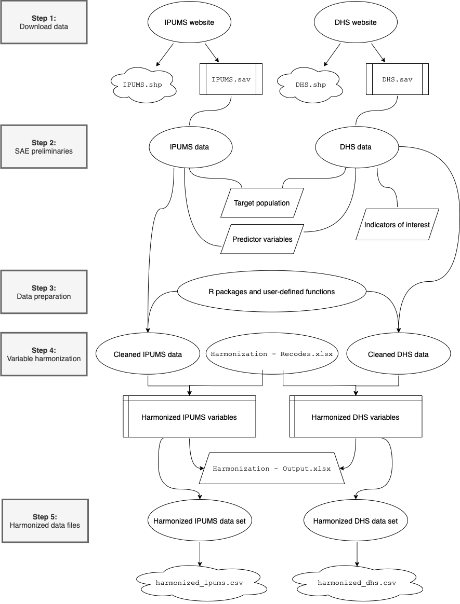

# (PART) Harmonization {-}

# Harmonization

This manual provides a step-by-step guide to harmonizing census and survey data for the purposes of small area estimation (SAE). More specifically, we describe how to create harmonized files of census data from IPUMS International (IPUMSI) and survey data from Demographic and Health Surveys (DHS). These harmonized data files can subsequently be used to construct SAE models for DHS indicator variables.

To motivate the technical instructions in this manual, we consider a case study involving data from the West African nation of Sierra Leone. Our objective is to construct SAE models for three DHS indicators: (1) Any contraceptive use, (2) modern contraceptive use, and (3) unmet need. To do so, we need to assemble harmonized data sets containing all the relevant predictor variables appearing in both the 2015 IPUMS sample and the 2019 DHS sample, as well as the appropriate geographic variables.

The diagram below provides a visual overview of the data harmonization procedure that we introduce in this manual:

{#id .class width=70% height=70%}

