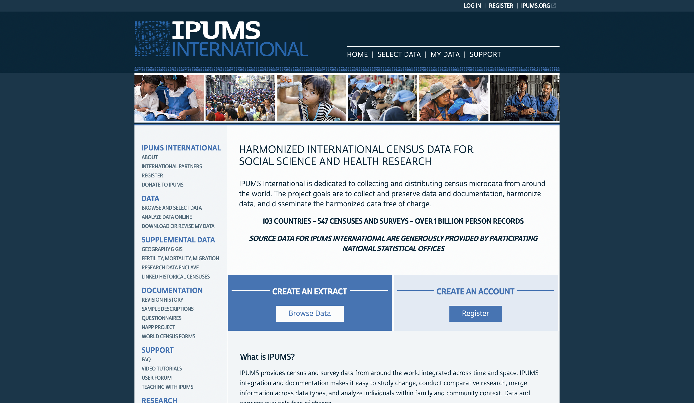

# Step 1: Download data

## Step 1A: IPUMS data and shapefiles

Navigate to the IPUMS International homepage (https://international.ipums.org/international):

{#id .class width=70% height=70%}

If this is your first time downloading data from IPUMS International, you will need to register for an account by clicking the blue "Register" button. If you already have an IPUMS International account, click the "Log In" button in the top right corner of the page.

Once you have logged into your account, you can begin creating a census data extract. Proceed as follows:

1. Click on "Select Data".
2. Click the blue "Select Samples" button in the top left corner.
3. You should see a column of countries, each with a corresponding row of years for which data are available. Identify the country of interest and check the box to the left of the year for which you would like to download the data. Then click the blue "Submit Sample Selections" button near the top of the page.
4. You should now have one sample in your data cart. Next, mark the circular button next to either "Harmonized Variables" or "Source Variables", depending on which type of variable you would like to use in your analysis. There is no wrong answer here — either harmonized variables or source variables can be used successfully for small area estimation. To read about the differences between the two, see the IPUMS International FAQ page (https://international.ipums.org/international-action/faq). For the Sierra Leone case study, we will use source variables.
5. Click the "Display Options" button in the top right corner of the page. Under the "Variable groups" heading, select "Show all groups together". Then click "Apply Selections".
6. You should now see a long list of variables. Add all of them to your data cart by clicking the circular plus sign next to each variable. Once you have filled your cart with all of the variables, click the blue "View Cart" button in the upper right corner of the page.
7. Take a quick look at the list of variables on the next page and verify that everything looks correct. Then click the blue "Create Data Extract" button.
8. This will bring you to the extract request page. In the row labeled "Data Format", click on the word "Change". Then, under the "Data Format" heading, change the format from "Fixed-width text (.dat)" to "SPSS (.sav)". Then click the "Apply Selections" button at the bottom of the page.
9. If you'd like, you can add a short description of your data extract. Then click "Submit Extract".
10. This will bring you to a page where you can download your extract. Depending on the size of the extract you created, it may take a little while to process. You will receive an email when it is ready to download. To download your data, click the green "Download SPSS" button.
11. Give the downloaded file a meaningful name and move it to a suitable directory.

You will also need to download the shapefile for the sample you selected above. For most small area estimation models, the initial model will be constructed at IPUMS's first administrative level using the survey data, and the model will make predictions at IPUMS's second administrative level using the census data. In the case of Sierra Leone, for example, the DHS indicators are modeled at the district level (first administrative level), and predictions are made at the chiefdom level (second administrative level).

Navigate to IPUMS International's GIS boundary files page (https://international.ipums.org/international/gis.shtml). Proceed as follows:

1. Click on "Year-specific second-level geography".
2. You should see a list of countries, along with a row of years for which the geographic data are available. Identify your country of interest and click the year for which you downloaded data above.
3. This will download a folder containing the corresponding shapefiles. Rename the folder if you'd like, and then move it to the directory from Step 11 above.

## Step 1B: DHS data and shapefiles

Navigate to the DHS homepage (https://dhsprogram.com):

{#id .class width=70% height=70%}

Click on "Login" at the top of the page. If this is your first time downloading DHS data, you will need to register for a new account. If you have downloaded DHS data before, you can log into your existing account.

Once you have logged into your account, proceed as follows to download the survey data and corresponding shapefiles:

1. Hover over the "Data" menu at the top of the page and select "Download Datasets".
2. In the blue "Select Country" dropdown menu, select the country of interest.
3. You should see a list of surveys from the country of interest. Out of all the Standard DHS samples (see the "Type" column), identify the one closest in year to the IPUMS sample from Step 1A. Ideally, there should be no more than a four- or five-year gap between the IPUMS and DHS samples. In the "Survey Datasets" column, click on "Data Available" for this sample.
4. This will bring you to a page containing a long list of data files. Under the "Individual Recode" heading in the "Survey Datasets" section, download the .zip file for the SPSS dataset (.sav). Once this .zip file is downloaded, unzip it. Give the downloaded files meaningful names and place them in the directory from Step 11 above.
5. Under the "Geographic Data" heading in the "Geographic Datasets" section, download the .zip file for the shape file (.shp). Once this .zip file is downloaded, unzip it. Give the downloaded files meaningful names and place them in the directory from Step 11 above.

