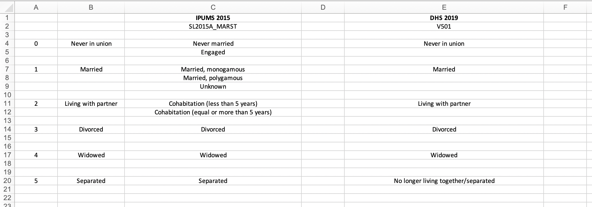

# Step 3: Data preparation

For the remainder of this manual, we will illustrate the processes of data cleaning and harmonization using data from Sierra Leone. Please note that while the general procedures in Steps 3, 4, and 5 are applicable to other SAE projects, the specific tasks required for other projects may vary.

If you do not already have `R` and `RStudio` downloaded on your computer, you will need to download them before proceeding. This page (https://cran.r-project.org) provides instructions for downloading `R`, and this page (https://www.rstudio.com/products/rstudio/download/) provides instructions for downloading `RStudio`. Once you have downloaded them, create a new R script called `[Country name] harmonization.R`.


## Step 3A: Packages and user-defined functions

Before reading in the data sets you downloaded in Step 1, load the following packages into `R` using the `library()` function.


```{r warning = FALSE, eval = FALSE}
library(foreign)
library(tibble)
library(haven)
library(expss)
library(dplyr)
library(openxlsx)
```


Note: If you have not previously one or more of these packages, you will need to install them using the `install.packages()` function (e.g., `install.packages(`"foreign"`)`).

We will also make use of four user-defined functions that are designed to clean up the harmonization process: `compare_categories()`, `new_var_label()`, `write_ipums_output()`, and `write_dhs_output()`. See the Appendix to read about these functions in detail. Feel free to ignore these details for now, though — you can always refer back to them later.


## Step 3B: IPUMS data preparation

First, identify the path to the IPUMS data file you downloaded in Step 1A:

```{r warning = FALSE, eval = FALSE}
path_ipums = "~/_OriginalData/SierraLeoneIPUMS2015/sl2015a_ipums.sav"
```

Next, store the IPUMS data file as a data frame. It may be helpful to store an original version of the data frame and make a copy for your actual analysis:
```{r warning = FALSE, eval = FALSE}
# Store original
sl2015_ipums_orig = read.spss(path_ipums, to.data.frame = TRUE)

# Make copy
sl2015_ipums = sl2015_ipums_orig
```

If you'd like, you can use the `View()` and `colnames()` functions to view a list of the names of all of the variables in the IPUMS data frame. This may be helpful if you did not identify the names of all of your predictor variables in Step 2B.
```{r warning = FALSE, eval = FALSE}
View(colnames(sl2015_ipums))
```

For the Sierra Leone data, it is necessary to convert age to a numeric variable, as it was categorical by default. This is an example of a country-specific data cleaning task. You may not need to do this for other countries, but you may also find that adjustments need to be made for other variables.
```{r warning = FALSE, eval = FALSE}
levels(sl2015_ipums$SL2015A_AGE)[1:3] = c("0", "1", "2")

levels(sl2015_ipums$SL2015A_AGE)[which(levels(sl2015_ipums$SL2015A_AGE) == "101+ years")] = "101"

sl2015_ipums$SL2015A_AGE = as.numeric(sl2015_ipums$SL2015A_AGE) - 1
```

Finally, filter the data frame to obtain the target population identified in Step 2C. You may need to explore the data frame a bit to figure out how to do this.
```{r warning = FALSE, eval = FALSE}
sl2015_ipums = sl2015_ipums[(sl2015_ipums$SL2015A_SEX == "Female" & 
                               sl2015_ipums$SL2015A_AGE >= 15 & sl2015_ipums$SL2015A_AGE <= 49 &
                               sl2015_ipums$SL2015A_HHTYPE == "Household"),]
```


## Step 3C: DHS data preparation

Here, we essentially reapply the procedures from Step 3B for the DHS sample. First, identify the path to the DHS data file you downloaded in Step 1B:
```{r warning = FALSE, eval = FALSE}
path_dhs = "~/_OriginalData/SierraLeoneDHS2019/SL_2019_DHS_10012021_1417_61748/SLIR7ASV/SLIR7AFL.SAV"
```

Next, store the DHS data file as a data frame. Again, it may be helpful to store an original version of the data frame and make a copy for your actual analysis:
```{r warning = FALSE, eval = FALSE}
# Store original
sl2019_dhs_ir_orig = read.spss(path_dhs, to.data.frame = TRUE)

# Make copy
sl2019_dhs_ir = sl2019_dhs_ir_orig
```

If you'd like, you can use the `View()` and `attr()` functions to view a list of the names of all of the variables in the DHS data frame. This may be helpful if you did not identify the names of your indicator(s) of interest in Step 2A or your DHS predictors in Step 2B.
```{r warning = FALSE, eval = FALSE}
View(attr(sl2019_dhs_ir, "variable.labels"))
```

At this point, you may need to clean the data and/or filter it in some way to obtain the target population, much like we did in Step 3B. For the DHS data from Sierra Leone, neither of these tasks were necessary.

Next, you will need to rescale the individual sample weight variable (`V005`) by dividing it by 1,000,000. Then use the user-defined function `new_var_label()` to assign a label to the new weight variable. This new variable label should be the original label concatenated with "(recode)".
```{r warning = FALSE, eval = FALSE}
# Rescale sample weight
sl2019_dhs_ir$V005R = sl2019_dhs_ir$V005/1000000

# Add variable label
sl2019_dhs_ir = new_var_label(sl2019_dhs_ir,
                              "Women's individual sample weight (6 decimals) (recode)")
```


## Step 3D: Create supporting files

The final step before beginning the harmonization process is to create some supporting documents that will help you along the way.

First, in Excel, create a blank workbook called `[Country name] Harmonization - Output.xlsx`. You will send weighted frequency tables of the harmonized variables to this workbook in Step 4. Also, in `R`, use the `createWorkbook()` function to create an empty object that will help you send the harmonized output to Excel.
```{r warning = FALSE, eval = FALSE}
sl_harmonization_output = createWorkbook()
```

Next, in Excel, create a blank workbook called `[Country name] Harmonization - Recodes.xlsx`. You will use this to stay organized during the process of category harmonization. Each sheet of this workbook should look something like the following:

{#id .class width=70% height=70%}

Finally, create a document to take notes, either in Microsoft Word, Google Docs, or your preferred note-taking software. Aligning the categories of different variables between the IPUMS and DHS samples requires some decision making, so you will want a space to jot down your justifications for these decisions.


