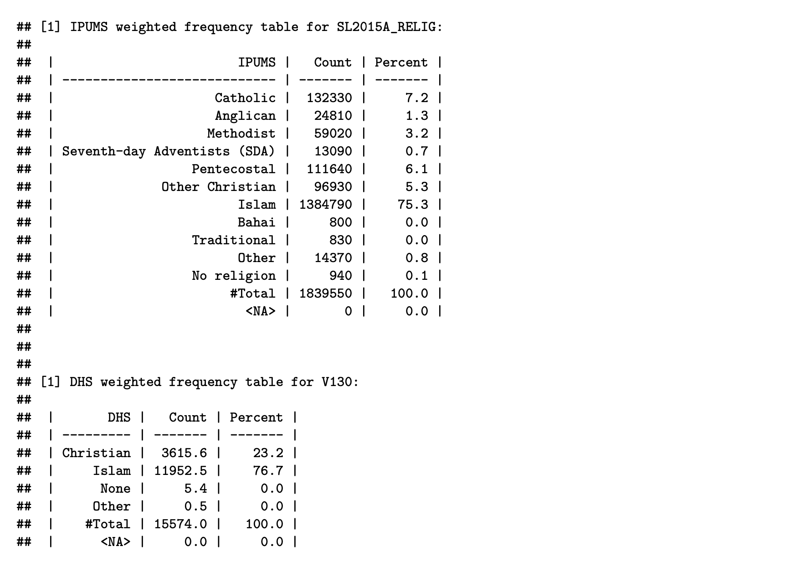

# Step 4: Variable harmonization

## Step 4A: Category alignment

The easiest way to demonstrate the harmonization process is through specific examples, so we will describe the harmonization of the `religion` variable for the Sierra Leone data. It is reasonable to assume that a woman's religion might influence her use of and/or demand for contraception, so we would like to include `religion` in our models for the three DHS indicators.

In Step 2B, we identified `V130` as the religion variable from the DHS sample and `SL2015A_RELIG` as the religion variable from the IPUMS sample. First, as an exploratory task, we use the user-defined function `compare_categories()' to run a quick weighted tabulation on these two variables. Note that we use the individual sample weights `V005R` and `PERWT` to weight the DHS and IPUMS samples, respectively.
```{r warning = FALSE, eval = FALSE}
compare_categories(ipums_data = "sl2015_ipums", ipums_var = "SL2015A_RELIG",
                   ipums_weight = "PERWT", dhs_data = "sl2019_dhs_ir",
                   dhs_var = "V130", dhs_weight = "V005R")
```

{#id .class width=70% height=70%}

We find that `SL2015A_RELIG` has more categories than `V130`, so the main harmonization task in this particular instance will be to consolidate the categories of `SL2015A_RELIG` to match those of `V130`.

I suggest moving out of `RStudio` temporarily and aligning these categories in the Excel workbook `[Country name] Harmonization - Recodes.xlsx` from Step 3D. The finished product can be seen below:


{#id .class width=70% height=70%}

A couple things to note:

- Column C contains the categories from the IPUMS variable `SL2015A_RELIG`.
- Column E contains the categories from the DHS variable `V130`. Bahai and Traditional actually *are* categories of the DHS variable `V130`, but they do not show up in the weighted frequency table above because zero cases were recorded in each of them.
- Column B contains the harmonized variable labels, which were determined during this process of category alignment. Column A contains an arbitrary numbering of these harmonized variable labels.

Harmonizing `SL2015A_RELIG` and `V130` is relatively straightforward. The six Christian denominations in `SL2015A_RELIG` can be matched with the single Christian category in `V130`. In both variables, there is one category for Islam, so these can be aligned next. In the weighted frequency tables above, we observe that Christianity and Islam account for close to 100% of the cases in both variables, and none of the remaining categories in either `SL2015A_RELIG` or `V130` have a significant number of cases. Therefore, it makes the most sense to combine the remaining labels into a harmonized category called "Other".


## Step 4B: Create harmonized IPUMS and DHS variables

Now we will move back into `RStudio` and create the harmonized variables for both IPUMS and DHS. First, use the `fre()` function from the `expss` package to save a copy of the weighted frequency table from above:
```{r warning = FALSE, eval = FALSE}
freq_RELIG = fre(sl2015_ipums$SL2015A_RELIG, weight = sl2015_ipums$PERWT)
```

Next, use the `factor()` and `ifelse()` functions to create the harmonized IPUMS variable. If you are unfamiliar with these functions, you can check out their respective help pages here (https://www.rdocumentation.org/packages/base/versions/3.6.2/topics/factor) and here (https://www.rdocumentation.org/packages/base/versions/3.6.2/topics/ifelse). We suggest naming the new variable `SL2015A_RELIGR`, which is just the original variable name with the letter "R" appended ("R" stands for "recode").
```{r warning = FALSE, eval = FALSE}
sl2015_ipums$SL2015A_RELIGR = 
  factor(ifelse(sl2015_ipums$SL2015A_RELIG == "Catholic" |
                 sl2015_ipums$SL2015A_RELIG == "Anglican" |
                 sl2015_ipums$SL2015A_RELIG == "Methodist" |
                 sl2015_ipums$SL2015A_RELIG == "Seventh-day Adventists (SDA)" |
                 sl2015_ipums$SL2015A_RELIG == "Pentecostal" |
                 sl2015_ipums$SL2015A_RELIG == "Other Christian",
               "Christian",
               ifelse(sl2015_ipums$SL2015A_RELIG == "Islam",
                      "Islam",
                      ifelse(sl2015_ipums$SL2015A_RELIG == "Bahai" |
                               sl2015_ipums$SL2015A_RELIG == "Traditional" |
                               sl2015_ipums$SL2015A_RELIG == "Other" |
                               sl2015_ipums$SL2015A_RELIG == "No religion",
                             "Other", NA))),
        levels = c("Christian", "Islam", "Other"))
```

The general idea behind these lines of code is as follows: If an individual is labeled as "Catholic", "Anglican", "Methodist", "Seventh-day Adventists (SDA)", "Pentecostal", and "Other Christian" in the original variable, assign them to a category called "Christian" in the harmonized variable. If they are in the "Islam" category in the original variable, assign them to a category called "Christian" in the harmonized variable. If they are assigned to "Bahai", "Traditional", "Other", or "No religion" in the original variable, assign them to "Other" in the harmonized variable. If any individuals are not covered by these three rules, mark them as missing (`NA`). (Note that no cases should be missing in the harmonized variable — if you notice any `NA` cases when tabulating the harmonized variable, you should go back and fix this issue.)

Next, use the user-defined function `new_var_label()` to assign a variable label to `SL2015A_RELIGR`. We suggest using a standard convention variable label where you simply append "(recode)" to the original variable label:
```{r warning = FALSE, eval = FALSE}
sl2015_ipums = new_var_label(sl2015_ipums, "Religion (recode)")
```

Finally, check your work by generating a weighted frequency table of the harmonized IPUMS variable:
```{r warning = FALSE}
freq_RELIGR = fre(sl2015_ipums$SL2015A_RELIGR, weight = sl2015_ipums$PERWT)
print(freq_RELIGR[,c(1:2, 4)])
```


{#id .class width=70% height=70%}

We have successfully created the harmonized IPUMS variable for `religion`, and we can basically apply the same procedures to create the harmonized DHS variable. First, we save a copy of the weighted frequency table:

```{r warning = FALSE, eval = FALSE}
V130_freq = fre(sl2019_dhs_ir$V130, weight = sl2019_dhs_ir$V005R, drop_unused_labels = FALSE)
```

Next, we use `factor()` and `ifelse()` to create the harmonized variable, which we name `V130R`. We also add a variable label for `V130R`:
```{r warning = FALSE, eval = FALSE}
# Create harmonized DHS variable
sl2019_dhs_ir$V130R = factor(ifelse(sl2019_dhs_ir$V130 == "Christian",
                                    "Christian",
                                    ifelse(sl2019_dhs_ir$V130 == "Islam",
                                           "Islam",
                                           ifelse(sl2019_dhs_ir$V130 == "Bahai" |
                                                    sl2019_dhs_ir$V130 == "Traditional" |
                                                    sl2019_dhs_ir$V130 == "Other" |
                                                    sl2019_dhs_ir$V130 == "None",
                                                  "Other", NA))),
                             levels = c("Christian", "Islam", "Other"))

# Add variable label
sl2019_dhs_ir = new_var_label(sl2019_dhs_ir, "Religion (recode)")
```

Finally, we generate a weighted frequency table for the harmonized DHS variable:
```{r warning = FALSE, eval = FALSE}
V130R_freq = frequency(sl2019_dhs_ir$V130R, weight = sl2019_dhs_ir$V005R, drop_unused_labels = FALSE)
print(V130R_freq[,c(1:2, 4)])
```


{#id .class width=70% height=70%}


## Step 4C: Write harmonization output to Excel

Now that we have created the harmonized variables for both the IPUMS data and the DHS data, we can organize our work in the Excel workbook `[Country name] Harmonization - Output.xlsx` that you created in Step 3D. Use the `addWorksheet()` function from the `openxlsx` package to create a new sheet called "Religion" within your workbook:
```{r warning = FALSE, eval = FALSE}
addWorksheet(sl_harmonization_output, "Religion")
```


Next, use the user-defined functions `write_ipums_output()` and `write_dhs_output()` to paste the weighted frequency tables for the harmonized IPUMS and DHS variables into this Excel sheet:
```{r warning = FALSE, eval = FALSE}
write_ipums_output(workbook_name = sl_harmonization_output,
                   sheet_name = "Religion",
                   ipums_data = sl2015_ipums,
                   ipums_var_names = c("SL2015A_RELIGR", "SL2015A_RELIG"),
                   ipums_freq_tables = list(freq_RELIGR, freq_RELIG),
                   output_start_row = 1)

write_dhs_output(workbook_name = sl_harmonization_output,
                 sheet_name = "Religion",
                 dhs_data = sl2019_dhs_ir,
                 dhs_var_names = c("V130R", "V130"),
                 dhs_freq_tables = list(V130R_freq, V130_freq),
                 output_start_row = 1)
```

Finally, use the `saveWorkbook()` function to save your Excel file:
```{r warning = FALSE, eval = FALSE}
saveWorkbook(sl_harmonization_output, file = "Sierra Leone harmonization - Output.xlsx",
             overwrite = TRUE)
```

After completing these steps, the "Religion" sheet in `[Country name] Harmonization - Output.xlsx` will look like this:

{#id .class width=70% height=70%}

We can see that the IPUMS variables appear on the left, with the harmonized variable `SL2015A_RELIGR` on top and the original variable `SL2015A_RELIG` on the bottom. The DHS variables appear on the right, with the harmonized variable `V130R` on top and the original variable `V130` on the bottom.

You should compare the percentages in columns C and K for the harmonized variables. Assuming that (1) the DHS data form a representative sample of the IPUMS data and (2) the categories of the variables used to construct the harmonized variables are comparable between IPUMS and DHS, these percentages should be very similar. Here, we see that both of these conditions appear to be satisfied, as the percentages are similar for Christian (23.8% vs. 23.2%), Islam (75.3% vs. 76.8%), and Other (0.9% vs. 0.05%).


## Step 4D: Miscellaneous notes

*Handling unknown cases:*

Some of the variables used to construct the harmonized IPUMS and DHS variables will have cases labeled as "unknown" (or something to that effect). These unknown cases almost always constitute a very small proportion of the total sample, so it typically won't matter how you classify them in Step 4A. For the Sierra Leone case study, we took the following approach:

- If the harmonized variable has a category called "other" (or something to that effect), simply assign the unknown cases to that category.
- If the harmonized variable does not have a category called "other", assign the unknown cases to the category with the highest number of cases.

For the religion example above, if there were unknown cases in either `SL2015A_RELIG` or `V130`, we would have assigned them to the "Other" category in the corresponding harmonized variable. In contrast, the image in Step 3D illustrates that in the case of marital status, the unknown cases in the variable `SL2015A_MARST` were assigned to the "Married" category (which must have been identified as the category with the highest number of cases in `SL2015A_MARST`).


*Creating the DHS indicators:*

At this stage, you should also create variables for your DHS indicators of interest (if they are not already in a suitable format in the DHS data set). You can use the same procedures described in Steps 4A through 4C above, although you will not have to worry about the IPUMS-related steps.

For example, we used the following code to create the variable for any contraceptive use, which was one of the three indicators of interest for the Sierra Leone case study:
```{r warning = FALSE, eval = FALSE}
### Step 4A

compare_categories(ipums_data = NULL, ipums_var = NULL, ipums_weight = NULL,
                   dhs_data = "sl2019_dhs_ir", dhs_var = "V313", dhs_weight = "V005R")


### Step 4B

# Original DHS variable
V313_freq = fre(sl2019_dhs_ir$V313, weight = sl2019_dhs_ir$V005R)

# Harmonized DHS variable
sl2019_dhs_ir$V313R1 = factor(ifelse(sl2019_dhs_ir$V313 == "Folkloric method" |
                                      sl2019_dhs_ir$V313 == "Traditional method" |
                                      sl2019_dhs_ir$V313 == "Modern method",
                                    1,
                                    ifelse(sl2019_dhs_ir$V313 == "No method",
                                           0, NA)),
                             levels = c(1, 0))

# New label for harmonized DHS variable
sl2019_dhs_ir = new_var_label(sl2019_dhs_ir, "Any contraceptive use")

# Weighted frequency table for harmonized DHS variable
V313R1_freq = fre(sl2019_dhs_ir$V313R1, weight = sl2019_dhs_ir$V005R)


### Step 4C

addWorksheet(sl_harmonization_output, "Any contraceptive use")

write_dhs_output(workbook_name = sl_harmonization_output,
                 sheet_name = "Any contraceptive use",
                 dhs_data = sl2019_dhs_ir,
                 dhs_var_names = c("V313R1", "V313"), 
                 dhs_freq_tables = list(V313R1_freq, V313_freq),
                 output_start_row = 1)

saveWorkbook(sl_harmonization_output, file = "Sierra Leone harmonization - Output.xlsx",
             overwrite = TRUE)
```

One important thing to note here: In order to be compatible with the SAE app, the harmonized variable should be binary with values `0` or `1`. For example, in the variable above that records whether the woman used any contraceptive method, a value of `1` indicates that she did, while a value of `0` indicates that she did not.


*Creating the census area variable:*

At this stage, you should also create the census area variable (if it is not already in a suitable format in the IPUMS data set). As a reminder, the census area variable is usually the second IPUMS administrative level; in the case of Sierra Leone, chiefdom is the census area variable. By the principles of SAE, this variable should appear in the IPUMS sample, but not the DHS sample. Therefore, you can follow the procedures described in Steps 4A through 4C above, but you will not have to worry about the DHS-related steps.


