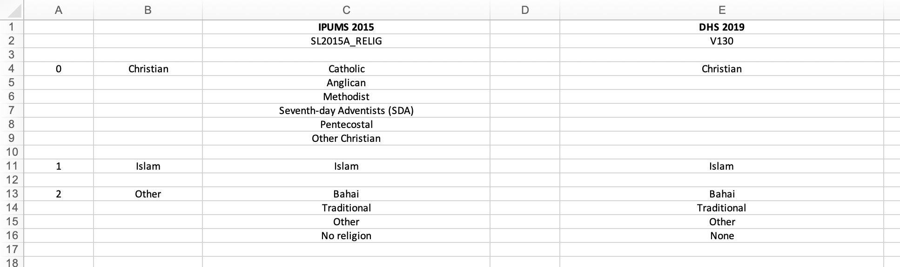

# Step 4: Variable harmonization

## Step 4A: Category alignment

The easiest way to demonstrate the harmonization process is through specific examples, so we will describe the harmonization of the `religion` variable for the Sierra Leone data. It is reasonable to assume that a woman's religion might influence her use of and/or demand for contraception, so we would like to include `religion` in our models for the three DHS indicators.

In Step 2B, we identified `V130` as the religion variable from the DHS sample and `SL2015A_RELIG` as the religion variable from the IPUMS sample. First, as an exploratory task, we use the user-defined function `compare_categories()' to run a quick weighted tabulation on these two variables. Note that we use the individual sample weights `V005R` and `PERWT` to weight the DHS and IPUMS samples, respectively.

```{r warning = FALSE, eval = FALSE}
compare_categories(ipums_data = "sl2015_ipums", ipums_var = "SL2015A_RELIG",
                   ipums_weight = "PERWT", dhs_data = "sl2019_dhs_ir",
                   dhs_var = "V130", dhs_weight = "V005R")
```

{#id .class width=70% height=70%}

We find that `SL2015A_RELIG` has more categories than `V130`, so the main harmonization task in this particular instance will be to consolidate the categories of `SL2015A_RELIG` to match those of `V130`.

I suggest moving out of `RStudio` temporarily and aligning these categories in the Excel workbook `[Country name] Harmonization - Recodes.xlsx` from Step 3D. The finished product can be seen below:


{#id .class width=70% height=70%}

A couple things to note:

- Column C contains the categories from the IPUMS variable `SL2015A_RELIG`.
- Column E contains the categories from the DHS variable `V130`. Bahai and Traditional actually *are* categories of the DHS variable `V130`, but they do not show up in the weighted frequency table above because zero cases were recorded in each of them.
- Column B contains the harmonized variable labels, which were determined during this process of category alignment. Column A contains an arbitrary numbering of these harmonized variable labels.

Harmonizing `SL2015A_RELIG` and `V130` is relatively straightforward. The six Christian denominations in `SL2015A_RELIG` can be matched with the single Christian category in `V130`. In both variables, there is one category for Islam, so these can be aligned next. In the weighted frequency tables above, we observe that Christianity and Islam account for close to 100% of the cases in both variables, and none of the remaining categories in either `SL2015A_RELIG` or `V130` have a significant number of cases. Therefore, it makes the most sense to combine the remaining labels into a harmonized category called "Other".


## Step 4B: Create harmonized IPUMS and DHS variables

Now we will move back into `RStudio` and create the harmonized variables for both IPUMS and DHS. First, use the `fre()` function from the `expss` package to save a copy of the weighted frequency table from above:
```{r warning = FALSE, eval = FALSE}
freq_RELIG = fre(sl2015_ipums$SL2015A_RELIG, weight = sl2015_ipums$PERWT)
```

Next, use the `factor()` and `ifelse()` functions to create the harmonized IPUMS variable. If you are unfamiliar with these functions, you can check out their respective help pages here (https://www.rdocumentation.org/packages/base/versions/3.6.2/topics/factor) and here (https://www.rdocumentation.org/packages/base/versions/3.6.2/topics/ifelse). We suggest naming the new variable `SL2015A_RELIGR`, which is just the original variable name with the letter "R" appended ("R" stands for "recode").
```{r warning = FALSE, eval = FALSE}
sl2015_ipums$SL2015A_RELIGR = 
  factor(ifelse(sl2015_ipums$SL2015A_RELIG == "Catholic" |
                 sl2015_ipums$SL2015A_RELIG == "Anglican" |
                 sl2015_ipums$SL2015A_RELIG == "Methodist" |
                 sl2015_ipums$SL2015A_RELIG == "Seventh-day Adventists (SDA)" |
                 sl2015_ipums$SL2015A_RELIG == "Pentecostal" |
                 sl2015_ipums$SL2015A_RELIG == "Other Christian",
               "Christian",
               ifelse(sl2015_ipums$SL2015A_RELIG == "Islam",
                      "Islam",
                      ifelse(sl2015_ipums$SL2015A_RELIG == "Bahai" |
                               sl2015_ipums$SL2015A_RELIG == "Traditional" |
                               sl2015_ipums$SL2015A_RELIG == "Other" |
                               sl2015_ipums$SL2015A_RELIG == "No religion",
                             "Other", NA))),
        levels = c("Christian", "Islam", "Other"))
```

The general idea behind these lines of code is as follows: If an individual is labeled as "Catholic", "Anglican", "Methodist", "Seventh-day Adventists (SDA)", "Pentecostal", and "Other Christian" in the original variable, assign them to a category called "Christian" in the harmonized variable. If they are in the "Islam" category in the original variable, assign them to a category called "Christian" in the harmonized variable. If they are assigned to "Bahai", "Traditional", "Other", or "No religion" in the original variable, assign them to "Other" in the harmonized variable. If any individuals are not covered by these three rules, mark them as missing (`NA`). (Note that no cases should be missing in the harmonized variable — if you notice any `NA` cases when tabulating the harmonized variable, you should go back and fix this issue.)

Next, use the user-defined function `new_var_label()` to assign a variable label to `SL2015A_RELIGR`. We suggest using a standard convention variable label where you simply append "(recode)" to the original variable label:
```{r warning = FALSE, eval = FALSE}
sl2015_ipums = new_var_label(sl2015_ipums, "Religion (recode)")
```

Finally, check your work by generating a weighted frequency table of the harmonized IPUMS variable:
```{r warning = FALSE}
freq_RELIGR = fre(sl2015_ipums$SL2015A_RELIGR, weight = sl2015_ipums$PERWT)
print(freq_RELIGR[,c(1:2, 4)])
```


{#id .class width=70% height=70%}

We have successfully created the harmonized IPUMS variable for `religion`, and we can basically apply the same procedures to create the harmonized DHS variable. First, we save a copy of the weighted frequency table:

```{r warning = FALSE, eval = FALSE}
V130_freq = fre(sl2019_dhs_ir$V130, weight = sl2019_dhs_ir$V005R, drop_unused_labels = FALSE)
```

Next, we use `factor()` and `ifelse()` to create the harmonized variable, which we name `V130R`. We also add a variable label for `V130R`:
```{r warning = FALSE, eval = FALSE}
# Create harmonized DHS variable
sl2019_dhs_ir$V130R = factor(ifelse(sl2019_dhs_ir$V130 == "Christian",
                                    "Christian",
                                    ifelse(sl2019_dhs_ir$V130 == "Islam",
                                           "Islam",
                                           ifelse(sl2019_dhs_ir$V130 == "Bahai" |
                                                    sl2019_dhs_ir$V130 == "Traditional" |
                                                    sl2019_dhs_ir$V130 == "Other" |
                                                    sl2019_dhs_ir$V130 == "None",
                                                  "Other", NA))),
                             levels = c("Christian", "Islam", "Other"))

# Add variable label
sl2019_dhs_ir = new_var_label(sl2019_dhs_ir, "Religion (recode)")
```

Finally, we generate a weighted frequency table for the harmonized DHS variable:
```{r warning = FALSE, eval = FALSE}
V130R_freq = frequency(sl2019_dhs_ir$V130R, weight = sl2019_dhs_ir$V005R, drop_unused_labels = FALSE)
print(V130R_freq[,c(1:2, 4)])
```


{#id .class width=70% height=70%}


## Step 4C: Write harmonization output to Excel

Now that we have created the harmonized variables for both the IPUMS data and the DHS data, we can organize our work in the Excel workbook `[Country name] Harmonization - Output.xlsx` that you created in Step 3D. Use the `addWorksheet()` function from the `openxlsx` package to create a new sheet called "Religion" within your workbook:
```{r warning = FALSE, eval = FALSE}
addWorksheet(sl_harmonization_output, "Religion")
```


# Appendix: User-defined R functions

## compare_categories

```{r warning = FALSE, eval = FALSE}
compare_categories = function(ipums_data = NULL, ipums_var = NULL, ipums_weight = NULL,
                              dhs_data = NULL, dhs_var = NULL, dhs_weight = NULL) {
  # This function creates a weighted frequency table for a maximum of one IPUMS 
  # variable and one DHS variable. The purpose of this function is to easily compare
  # the categories and frequencies of potentially harmonizable IPUMS and DHS 
  # variables as a preliminary step in the harmonization process.
  #
  # Inputs:
  #   ipums_data = Name of the IPUMS data frame (e.g., "sl2015_ipums"). Must be 
  #                 entered as a string.
  #   ipums_var = Name of the variable in the IPUMS data frame for which the table
  #                 is to be constructed (e.g., "SL2015_MARST"). Must be entered
  #                 as a string.
  #   ipums_weight = Name of the variable in the IPUMS data frame corresponding to 
  #                   the weight variable (e.g., "PERWT"). Must be entered as a string.
  #   dhs_data = Name of the DHS data frame (e.g., "sl2019_dhs_ir"). Must be entered 
  #               as a string.
  #   dhs_var = Name of the variable in the DHS data frame for which the table is to 
  #               be constructed (e.g., "V501"). Must be entered as a string.
  #   dhs_weight = Name of the variable in the IPUMS data frame corresponding to the 
  #                 weight variable (e.g., "V005R"). Must be entered as a string.
  #
  # Prints:
  #   Two tables of weighted counts and percents: One for ipums_var, and one for dhs_var.
  #
  
  
  if(!any(is.null(ipums_data), is.null(ipums_var), is.null(ipums_weight))) {
    IPUMS = eval(parse(text = noquote(paste0(ipums_data, "$", ipums_var))))
    weight_ipums = eval(parse(text = noquote(paste0(ipums_data, "$", ipums_weight))))
    
    print(noquote(paste0("IPUMS weighted frequency table for ", ipums_var, ":")))
    print(fre(IPUMS, weight = weight_ipums)[, c(1:2, 4)])
    
    cat("\n\n\n")
  }
  
  if(!any(is.null(dhs_data), is.null(dhs_var), is.null(dhs_weight))) {
    DHS = eval(parse(text = noquote(paste0(dhs_data, "$", dhs_var))))
    weight_dhs = eval(parse(text = noquote(paste0(dhs_data, "$", dhs_weight))))
    
    print(noquote(paste0("DHS weighted frequency table for ", dhs_var, ":")))
    print(fre(DHS, weight = weight_dhs)[, c(1:2, 4)])
  }
}
```


## new_var_label

```{r warning = FALSE, eval = FALSE}
new_var_label = function(dataframe, label) {
  # This function appends a variable label to a data frame.
  #
  # Inputs:
  #   dataframe = The data frame to which the user would like to append a variable label.
  #   label = Variable label that the user would like to append to the data frame. Must be
  #           a string of characters; otherwise, the function will return an error message.
  #
  # Returns:
  #   An updated version of the dataframe that includes the new variable label.
  #
  
  attr(dataframe, "variable.labels") = c(attr(dataframe, "variable.labels"), label)
  
  return(dataframe)
}
```


## write_ipums_output

```{r warning = FALSE, eval = FALSE}
write_ipums_output = function(workbook_name, sheet_name, ipums_data, ipums_var_names, 
                              ipums_freq_tables, output_start_row = 1) {
  # This function writes the IPUMS harmonization output to an excel workbook.
  #
  # Inputs:
  #   workbook_name = Name of the object that identifies the excel workbook in which the output 
  #                   is being stored.
  #   sheet_name = Name of the sheet within workbook_name to which the output should be written.
  #   ipums_data = Name of the IPUMS dataset.
  #   ipums_var_names = Vector of IPUMS variable names indicating the variables that are to be 
  #                     written to sheet_name. Must be the same length as ipums_freq_tables, 
  #                     otherwise the function returns an error message. Must also have a length 
  #                     of no more than 3, otherwise the function returns an error message.
  #   ipums_freq_tables = List of data frames corresponding to the variables listed in ipums_var_names.
  #                       Must be the same length as ipums_var_names, otherwise the function returns 
  #                       an error message. Must also have a length of no more than 3, otherwise the 
  #                       function returns an error message.
  #
  # Returns:
  #   Nothing. The function prints the output to the excel sheet/workbook, as specified by the user.
  #
  
  if (length(ipums_var_names) != length(ipums_freq_tables)) {
    return("Error: ipums_var_names must be the same length as ipums_freq_tables.")
  }
  
  if (length(ipums_var_names) > 3) {
    return("Error: ipums_var_names and ipums_freq_tables must have lengths of no more than 3.")
  }
  
  for (i in 1:length(ipums_var_names)) {
    if (i == 1) {
      writeData(workbook_name, sheet = sheet_name, startRow = output_start_row, "IPUMS 2015")
      writeData(workbook_name, sheet = sheet_name, startRow = output_start_row + 1,
                attr(ipums_data, "variable.labels")[which(attr(ipums_data, "names") == 
                                                            ipums_var_names[i])])
      writeData(workbook_name, sheet = sheet_name, startRow = output_start_row + 3,
                cbind(ipums_freq_tables[[i]][,1], round(ipums_freq_tables[[i]][,2], 0), 
                      round(ipums_freq_tables[[i]][,-c(1,2)], 2)))
    }
    if (i == 2) {
      writeData(workbook_name, sheet = sheet_name, startRow = nrow(ipums_freq_tables[[i - 1]]) + 
                  (output_start_row + 7),
                attr(ipums_data, "variable.labels")[which(attr(ipums_data, "names") == 
                                                            ipums_var_names[i])])
      writeData(workbook_name, sheet = sheet_name, startRow = nrow(ipums_freq_tables[[i - 1]]) + 
                  (output_start_row + 9),
                cbind(ipums_freq_tables[[i]][,1], round(ipums_freq_tables[[i]][,2], 0), 
                      round(ipums_freq_tables[[i]][,-c(1,2)], 2)))
    }
    if (i == 3) {
      writeData(workbook_name, sheet = sheet_name, startRow = nrow(ipums_freq_tables[[i - 2]]) + 
                  nrow(ipums_freq_tables[[i - 1]]) + (output_start_row + 13),
                attr(ipums_data, "variable.labels")[which(attr(ipums_data, "names") == 
                                                            ipums_var_names[i])])
      writeData(workbook_name, sheet = sheet_name, startRow = nrow(ipums_freq_tables[[i - 2]]) + 
                  nrow(ipums_freq_tables[[i - 1]]) + (output_start_row + 15),
                cbind(ipums_freq_tables[[i]][,1], round(ipums_freq_tables[[i]][,2], 0), 
                      round(ipums_freq_tables[[i]][,-c(1,2)], 2)))
    }
  }
}
```


## write_dhs_output

```{r warning = FALSE, eval = FALSE}
write_dhs_output = function(workbook_name, sheet_name, dhs_data, dhs_var_names, 
                            dhs_freq_tables, output_start_row = 1) {
  # This function writes the DHS harmonization output to an excel workbook.
  #
  # Inputs:
  #   workbook_name = Name of the object that identifies the excel workbook in which the output 
  #                   is being stored.
  #   sheet_name = Name of the sheet within workbook_name to which the output should be written.
  #   dhs_data = Name of the DHS dataset.
  #   dhs_var_names = Vector of DHS variable names indicating the variables that are to be 
  #                   written to sheet_name. Must be the same length as dhs_freq_tables, otherwise 
  #                   the function returns an error message. Must also have a length of no more 
  #                   than 3, otherwise the function returns an error message.
  #   dhs_freq_tables = List of data frames corresponding to the variables listed in dhs_var_names. 
  #                     Must be the same length as dhs_var_names, otherwise the function returns an 
  #                     error message. Must also have a length of no more than 3, otherwise the 
  #                     function returns an error message.
  #
  # Returns:
  #   Nothing. The function prints the output to the excel sheet/workbook, as specified by the user.
  #
  
  if (length(dhs_var_names) != length(dhs_freq_tables)) {
    return("Error: dhs_var_names must be the same length as dhs_freq_tables.")
  }
  
  if (length(dhs_var_names) > 3) {
    return("Error: dhs_var_names and dhs_freq_tables must have lengths of no more than 3.")
  }
  
  
  for (i in 1:length(dhs_var_names)) {
    if (i == 1) {
      writeData(workbook_name, sheet = sheet_name, startRow = output_start_row, startCol = 10, 
                "DHS 2019")
      writeData(workbook_name, sheet = sheet_name, startRow = output_start_row + 1, startCol = 10,
                attr(dhs_data, "variable.labels")[which(attr(dhs_data, "names") == 
                                                          dhs_var_names[i])])
      writeData(workbook_name, sheet = sheet_name, startRow = output_start_row + 3, startCol = 10,
                cbind(dhs_freq_tables[[i]][,1], round(dhs_freq_tables[[i]][,2], 0), 
                      round(dhs_freq_tables[[i]][,-c(1,2)], 2)))
    }
    if (i == 2) {
      writeData(workbook_name, sheet = sheet_name, startRow = nrow(dhs_freq_tables[[i - 1]]) + 
                  (output_start_row + 7), startCol = 10,
                attr(dhs_data, "variable.labels")[which(attr(dhs_data, "names") == 
                                                          dhs_var_names[i])])
      writeData(workbook_name, sheet = sheet_name, startRow = nrow(dhs_freq_tables[[i - 1]]) + 
                  (output_start_row + 9), startCol = 10,
                cbind(dhs_freq_tables[[i]][,1], round(dhs_freq_tables[[i]][,2], 0), 
                      round(dhs_freq_tables[[i]][,-c(1,2)], 2)))
    }
    if (i == 3) {
      writeData(workbook_name, sheet = sheet_name, startRow = nrow(dhs_freq_tables[[i - 2]]) + 
                  nrow(dhs_freq_tables[[i - 1]]) + (output_start_row + 13), startCol = 10,
                attr(dhs_data, "variable.labels")[which(attr(dhs_data, "names") == 
                                                          dhs_var_names[i])])
      writeData(workbook_name, sheet = sheet_name, startRow = nrow(dhs_freq_tables[[i - 2]]) + 
                  nrow(dhs_freq_tables[[i - 1]]) + (output_start_row + 15), startCol = 10,
                cbind(dhs_freq_tables[[i]][,1], round(dhs_freq_tables[[i]][,2], 0), 
                      round(dhs_freq_tables[[i]][,-c(1,2)], 2)))
    }
  }
}
```