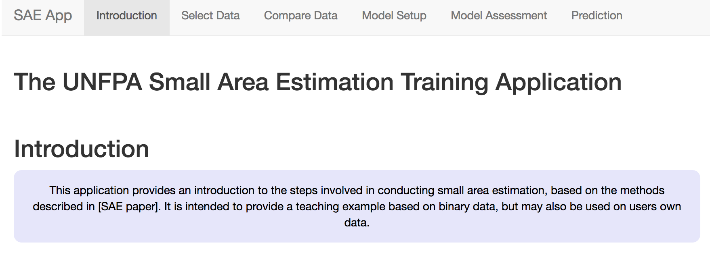

# About the Application

The UNFPA's Small Area Estimation App is a freely-available user-friendly tool that allows a novice user to automatically build small area estimation models, view the results and create predictions.  Tha application is built in the R programming language and can be downloaded from Github onto a computer that has R and Rstudio installed.  

## Instructions for download
1. Ensure you have installed R and RStudio and have a connection to the internet. It is best if you have a recent version of R.
2. Ensure that you have Git installed.
3. Open RStudio, click on file, New Project. 
4. In the new project wizard, select 'Version Control', then 'Git'.
5.  Type (or copy paste) the URL: "https://github.com/tomasbird/SAEpackage" into the URL field, and select a directory location for the package and click 'Create Project'. This will clone the current version of the application to your hard drive.  This will download all the files, directories and data needed to run this demo.
6. To open the project in RStudio,  click on the 'SAEpackage.Rproj' file in your local directory.
7. To prepare the App in Rstudio, write devtools::load_all() at the command prompt and hit enter.
8. On the first loading of the App,  Rstudio will probably take a long time downloading and installing other packages needed to run the App.  This only happens the first time the app is run, please be patient.
9. When the load has completed, type 'SAEapp()' to start the application

## How to navigate the application
The application consists of different tabs for each stage of the analysis. These include selecting and comparing data, Setup of the models, model assessment and finally prediction. Under each tab, simple directions allow the user to control outputs and download results. Note that the contents of each tab depend on the previous tab results, so errors in data setup will propogate through the application and may result in error messages instead of expected results. 
  

## Landing Page
The landing page provides the gateway to the application features. Use the tabs at the top of the page to access different parts of the application. 
  
 
{#id .class width=70% height=70%}
  

 
Population demographic data found in international household surveys often use binary responses to estimate prevalence rates in populations. Because of this, the application uses a logistic regression modeling approach.  In addition, the distribution of effort in population health surveys is not equal within the regions, meaning that over-representation of sampling effort in some areas may bias results in others. For this reason, the application allows for use of a random effects model. 

At present, the app is not suitable for continuous response variables. Future iterations may provide this functionality. 

