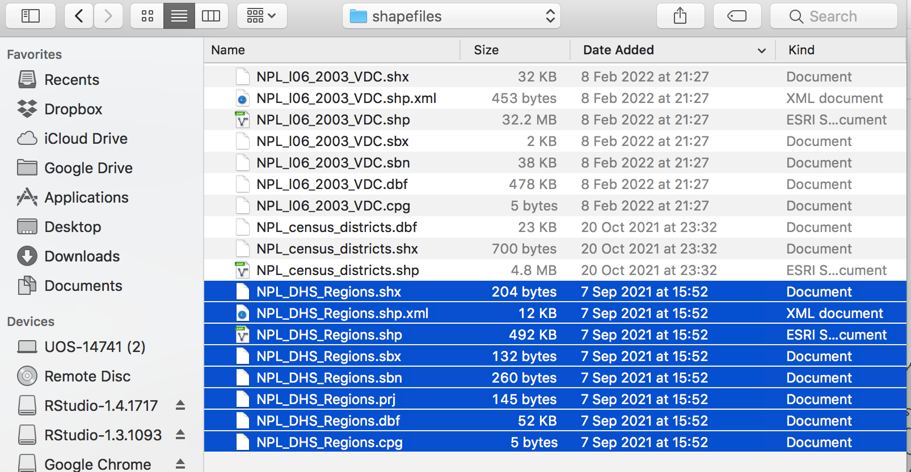
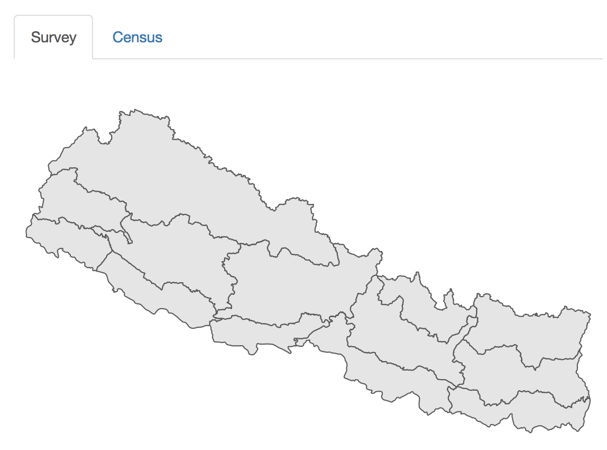

# (PART) SAE Application {-}

# Selecting Data
The Data selection tab allows users to either use sample DHS and survey datasets from Nepal, or to load the their own data.  Currently the applica tion does not allow for formatting of data, so all numerical data must be in a harmonized prior to being entered into the application. 
  
 
{#id .class width=70% height=70%}
  
 
For a detailed description of the harmonization process, see ____.: At minimum,  

1. Item. Survey and census data must share exactly the same variable names
2. Item. Variables that are common between survey and census must have the same definitions.  For example, categorical variables must have the same number of classes, and these classes must be identical between the two sources
3. Item. Variables must have roughly similar distributions between census and survey datasets. 

Code used to conduct harmonization are included in the appendix.    

Survey and census data each have their own tabs to assist with data loading.  By default, data from Nepal will load, as the 'Use Nepal data' checkbox will be checked. To use other data, uncheck this box.
 
  
  
{#id .class width=30% height=30%}
 

 

## Survey tab
Survey data should include three different types of data:  the indicator of interest,  a column for the names of the survey regions used and additional columns for variables that will be used in the predictive model.  If loading an external file, uncheck the 'Use Nepal Data' box and click on the 'choose a .csv file' box to select a file.
 

{#id .class width=60% height=60%}

{#id .class width=30% height=30%}
 

Once you have selected a file, it should appear at the bottom of the page.  
  
  
{#id .class width=70% height=70%}
  
 

Next, select a shapefile representing the survey regions.  
{#id .class width=30% height=30%}
  
 
At present, only ESRI shapefiles are accepted.  it is also important that when selecting the shapefile,  all associated files are selected. Once a shapefile has been loaded it should appear at the top of the page. 
  
   

{#id .class width=60% height=60%}
  
 

Once the shapefiles are loaded, a map will appear, unless there has been an error. 
  
 

{#id .class width=50% height=50%}
  
 
  
When the survey data have been loaded, you should select which variable will be the indicator to model, using the drop-down menu.
 

{#id .class width=30% height=30%}
  
 
  
Note that only binary variables are currently supported.  Variables should be formatted as '0' or '1' only.  Users should then select which variable represents the region or strata names in the data, as these will be used both in mapping and in creation of fixed or random effects. These region names should also be present and identically named in the census data to ensure accurate matching between the datasets.  
  
   

{#id .class width=30% height=30%}
  
 
  
## Census
  
  
When selecting the census tab, default the map and table information will take some time to load as the datasets are larger.
 
  
{#id .class width=50% height=50%}
  
 
  
After the survey data are loaded, Census data should be loaded in a similar way. Note that the census data should include both the same survey stratum names as the survey data, as well as an additional spatial stratum representing the area at which predictions will be made.
  
  
{#id .class width=30% height=30%}
  
 
  
Users then can select the predictor variables that will be. Note that only predictors that appear in both survey and census data can be selected. To reduce confusion, it is best that the loaded data only include variables that will be relevant to the analysis. However, these variables can be removed later if they are not needed.
  
  
{#id .class width=30% height=30%}
  