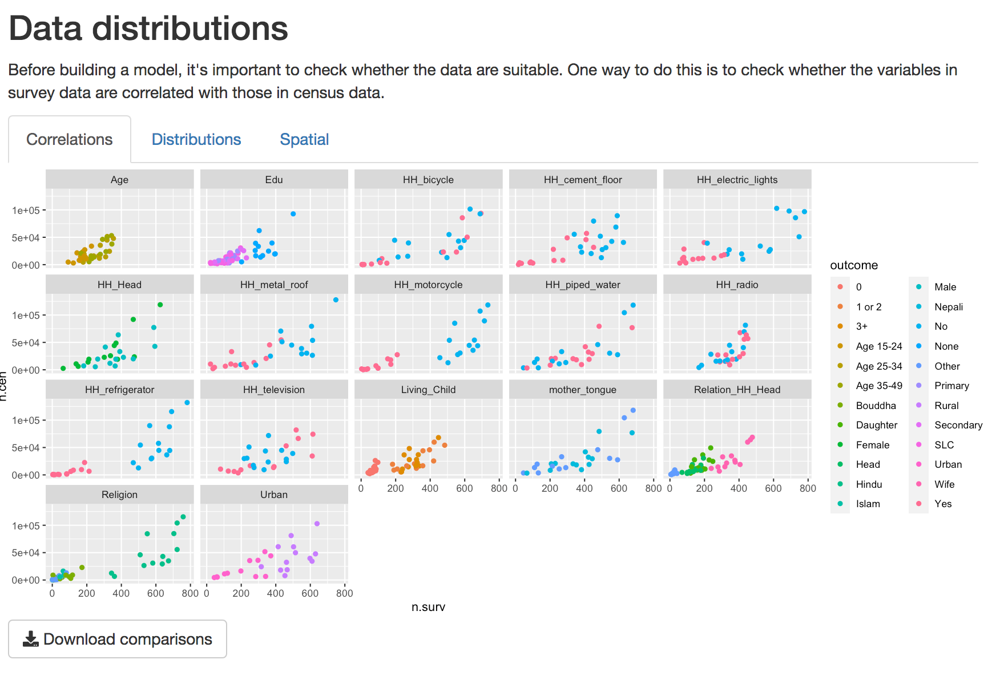
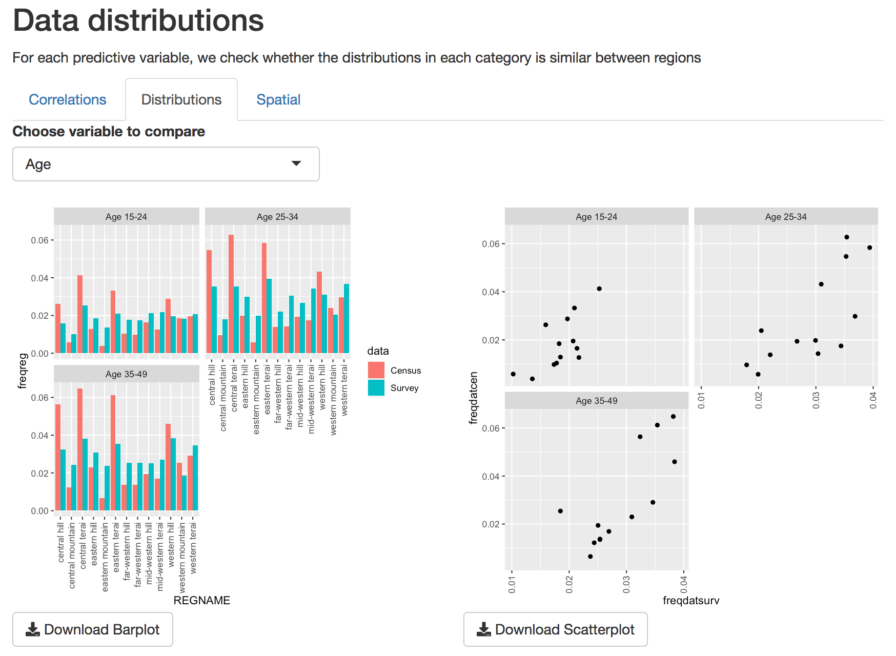

  
# Compare Data Sources
Predictive modeling of small areas based on survey data relies on the assumption that the populations sampled in the survey are a random sample of the census. As such, the types of respondents in census and survey data should be present in similar ratios for each.  Therefore, before modeling the indicator of interest, it is important to compare the distribution in each.  
  
 
 
## Correlations
A simple way to check whether the two data types are related is to look at how closely they are correlated.  This can be difficult to do with binary data, so we aggregate these data at the level of survey regions and visualize as a scatterplot.  By default these correlations are only shown for variables checked in the 'Data Selection' tab.  

When opening the **Compare data** Tab, the first tab displays a scatterplot of the correlations between data variables. These plots are based on data aggregated at the survey region level. Variables that appear linearly correlated between survey and census shold be considered for inclusion in the model. Those that are not should be excluded, unless there is some reason to explicitly include them.
  
  
{#id .class width=50% height=50%}
  
  
 
## Distributions.
For a closer look at individual predictors, in the distributions tab we look more closely at the distributions of individual variables to see how different levels of each variable correlate. Use the drop-down menu to select which variable to view. Here we can look more closely at the different levels of each variable. 
  
 

{#id .class width=50% height=50%}
  
  
 
## Spatial
Finally, it's important that the spatial distribution of effort is similar in survey and census data. The map in the spatial section shows the relative effort applied in each survey region. 
   

{#id .class width=50% height=50%}
