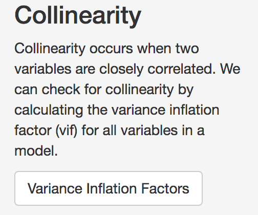
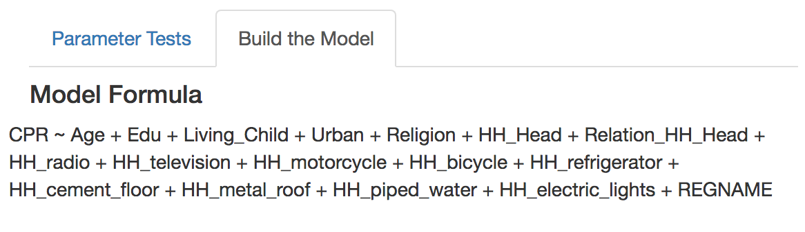
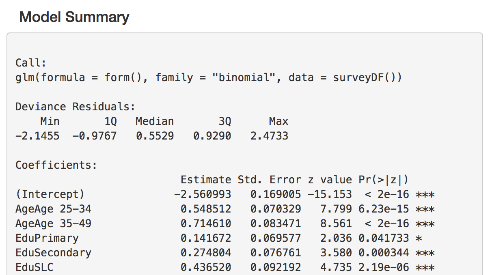

# Model Setup
The model setup tab provides tools to further check the suitability of variables for prediction before building the model. The model building component then allows you to see how inclusion of different parameters influences the model outcome.
   

{#id .class width=50% height=50%}

 
## Parameter Tests
The parameter tests component uses alias testing and variance inflation factors to look for variables that are highly correlated with one another.  The Alias test button looks for variables that are perfectly correlated, and must be run before the Collinearity or Variance Inflation Factors (VIF) test.  The VIF test checks each variable for variance inflation. Run the Alias test first, as the VIF test cannot run on variables that are nearly identical.  
 

{#id .class width=30% height=30%}

The results of the Alias test will indicate whether there are variables that need removing from the candidate variable set. 
 

{#id .class width=50% height=50%}
 

When variables are identified in the Alias test, you can remove them from the list of parameters
 

{#id .class width=30% height=30%}

After removing the indicated variables from the list of predictors, you should re-run the alias test, then you can run the VIF test to test for collinearity. 
 

{#id .class width=30% height=30%}

In the VIF test, results show a GVIF score and a degrees of freedom (DF). Variables that have a GVIF score of higher than 2 should be removed also, as including them may lead to unexpected predictions. 
 

{#id .class width=60% height=60%}
 

## Build the Model
Once the Variance inflation test has been done,  you can proceed to building the model by selecting the 'Build the Model'.  By default, the model consists of all variables that were not deselected in previous steps. As well, the spatial regions are by default included as a fixed effect.  
 

{#id .class width=60% height=60%}
 

The model  results are displayed as a summary table. In this summary, the estimates of the model coefficients are displayed on the logit scale, along with other statistics. Significance of each coefficient is indicated with stars, where * = significance at p=0.05, ** = significance at p=0.01, *** = significance at p=0.001. 

{#id .class width=60% height=60%}
 

Every time a variable is added, the model is re-run, and a new summary table is built.  If you wish to save the results of a particular model, you can save them using the download button.  
 

### Stepwise Regression. 
While you may have predictors that you wish to include,  but it may be difficult to decide which combination of variables is best to use.  In this case, you may use the stepwise variable selection button to choose the most parsimonious set of variables.  The tool uses both forward and backwards stepwise selection, and retains the model with the lowest AIC score. The selected variables will remain checked in the list.  
 

{#id .class width=30% height=30%}

### Random effects
Because the sampling effort in each of the survey regions can often be different, treating thema s a fixed effect may not be the most reliable way to account for regional variations. Instead, it is possible to include spatial regions as a random effect. In this way, oversampling in some areas will not skew results, and the uncertainty in estimates will be properly accounted for. Checking the 'include random effects' box will change the fixed effects to random effects in the model.  
 

{#id .class width=30% height=30%}
 

Note that including random effects in the model will make it much slower to run.  It is best to first run the variable selection before including the random effect term.   
 

