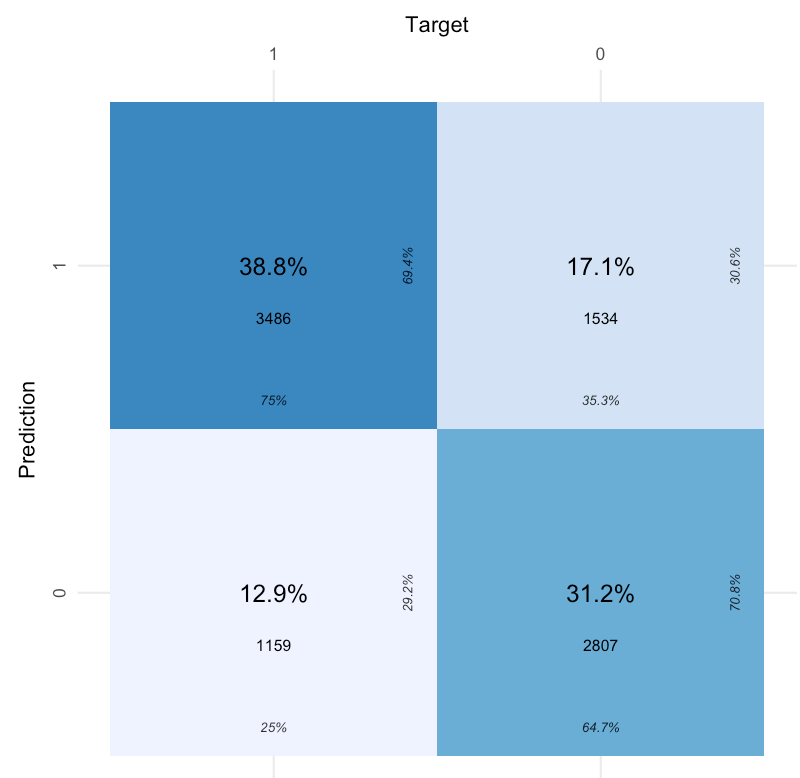
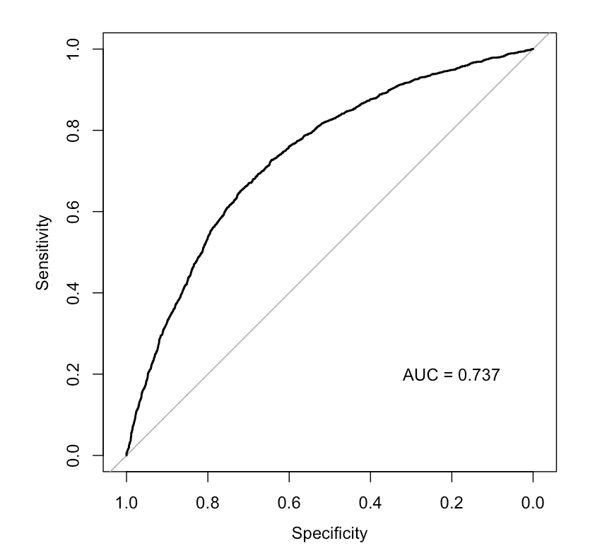

# Assessment of model fit
Following fitting of the model, it is important to check whether the model fit is suitable
 

## Assessment
The 'Assess' tab two a few ways to check the fit of the model.  The first is the residual plot, which shows each of the predicted response values used in the model against the difference between the observed and predicted values.  A model that has equal dispersion of points above and below the line indicates an unbiased fit. 
 

{#id .class width=50% height=50%}
 

We can also look at howthe observed values compare to the fitted values.  With binary variables this can be challenging to intepret, se we can look at observed and predicted values aggregated in survey regions.  Note that because we have included survey regions as a fixed or random effect, we expect that the model will usually perform very well at this aggregated level. 
 

{#id .class width=50% height=50%}

# Validation
Another way to evaluate  the predictive power for binomial random variables in a logistic model is to look at the percentage of times the model correctly classifies the response variable.  A Confusion matrix describes the percentage of time the model correctly predicts a true positive or true negative. A better-performing model should have higher true positive and negative rates than false rates. 
 

{#id .class width=50% height=50%}
 

Another way to look at model performance is to examine the receiver-operator curve or ROC.  This curve plots 'Sensitivity' against 'Specificity', which can be described as the rate of false positives (y axis) at each level of true positivity (x axis). An ROC curve that is more convex (or farther from the diagonal) suggests better model performance.  The area under the ROC curve (or AUC) provides a measure of the model accuracy; an AUC of 0.5 means the model cannot predict with any accuracy, while an AUC means it is perfectly accurate.  Values of greater than 0.75 suggest relatively good model performance.    
 

{#id .class width=50% height=50%}
 

## Cross Validation
Finally, the goal of small area prediction is to predict data into areas that have not been sampled.  The most effective way to tell whether a model is reliable in this case is to perform croass-validation testing.  Here,  we randonly split the data into sections called 'Folds'.  In each iteration of the cross-validation, one of these folds is excluded from the main data (the testing data), then the remaining data are used to build the model (the training data).  The resulting model is then used to predict the indicator of interest in both sets of data with similar accuracy.  
 

{#id .class width=50% height=50%}
  
  