# Introduction

This document provides an introduction the the UNFPA small area estimation application.  Small area estimation is a statistical method often used to combine high-resolution census data with 
subject-specific but lower-resolution household surveys. This application provides a user-friendlty interface for conducting a small-area estimation analysis. It includes an interface for loading numerical census 
and survey data, as well as shapefiles for display of results.  Users are directed to choose the relevant indicatorsfrom survey data, as well as variables that are common to both survey and census data as a basis for building a linear model. The application presents methods for checking the suitability of variables for modeling.  When the user has constructed a suitable model, the app allows for diagnostic testing of model results and finally prediction of the results into relevant census units. Users can export analytic steps as tabular or figure results.

  
***
  
# Background
The methods used in this application were described by the UNFPA's Small Area Estimation Guidance.  
  

## Analytic Approach
Population demographic data found in international household surveys often use binary responses to estimate prevalence rates in populations. Because of this, the application uses a logistic regression modeling approach.  In addition, the distribution of effort in population health surveys is not equal within the regions, meaning that over-representation of sampling effort in some areas may bias results in others. For this reason, the application allows for use of a random effects model. 

At present, the app is not suitable for continuous response variables. Future iterations may provide this functionality. 
  
 
## How to use the application
The application consists of different tabs for each stage of the analysis. These include selecting and comparing data, Setup of the models, model assessment and finally prediction. Under each tab, simple directions allow the user to control outputs and download results. Note that the contents of each tab depend on the previous tab results, so errors in data setup will propogate through the application and may result in error messages instead of expected results. 
  
***

# Landing Page
The landing page provides the gateway to the application features. Use the tabs at the top of the page to access different parts of the application. 
  
 
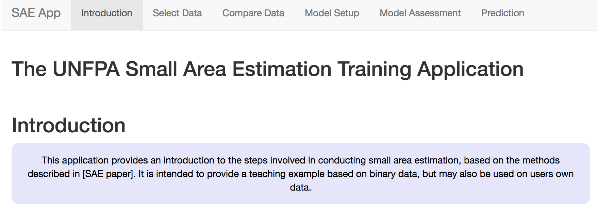{#id .class width=70% height=70%}
  

***

# Select Data
The Data selection tab allows users to either use sample DHS and survey datasets from Nepal, or to load the their own data.  Currently the application does not allow for formatting of data, so all numerical data must be in a harmonized prior to being entered into the application. 
  
 
{#id .class width=70% height=70%}
  
 
For a detailed description of the harmonization process, see ____.: At minimum,  

1. Item. Survey and census data must share exactly the same variable names
2. Item. Variables that are common between survey and census must have the same definitions.  For example, categorical variables must have the same number of classes, and these classes must be identical between the two sources
3. Item. Variables must have roughly similar distributions between census and survey datasets. 

Code used to conduct harmonization are included in the appendix.    

Survey and census data each have their own tabs to assist with data loading.  By default, data from Nepal will load, as the 'Use Nepal data' checkbox will be checked. To use other data, uncheck this box.
 
  
  
{#id .class width=30% height=30%}
 

 

## Survey tab
Survey data should include three different types of data:  the indicator of interest,  a column for the names of the survey regions used and additional columns for variables that will be used in the predictive model.  If loading an external file, uncheck the 'Use Nepal Data' box and click on the 'choose a .csv file' box to select a file.
 

{#id .class width=60% height=60%}

{#id .class width=30% height=30%}
 

Once you have selected a file, it should appear at the bottom of the page.  
  
  
{#id .class width=70% height=70%}
  
 

Next, select a shapefile representing the survey regions.  
{#id .class width=30% height=30%}
  
 
At present, only ESRI shapefiles are accepted.  it is also important that when selecting the shapefile,  all associated files are selected. Once a shapefile has been loaded it should appear at the top of the page. 
  
   

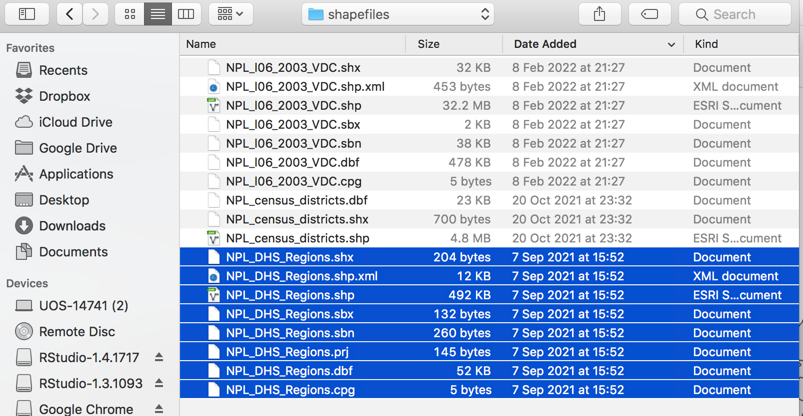{#id .class width=60% height=60%}
  
 

Once the shapefiles are loaded, a map will appear, unless there has been an error. 
  
 

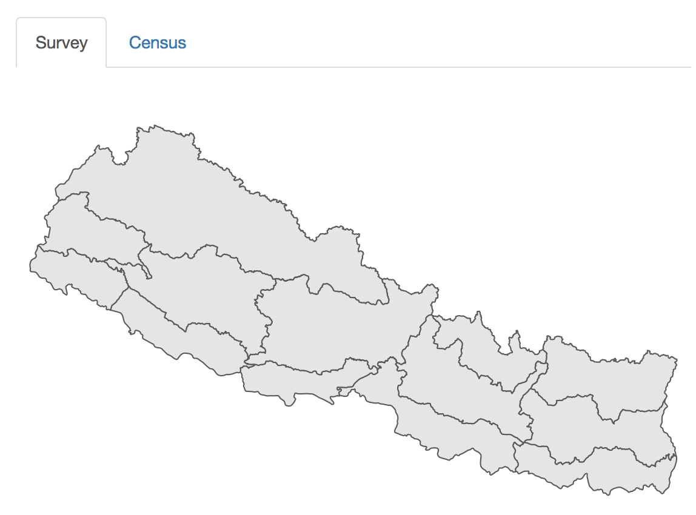{#id .class width=50% height=50%}
  
 
  
When the survey data have been loaded, you should select which variable will be the indicator to model, using the drop-down menu.
 

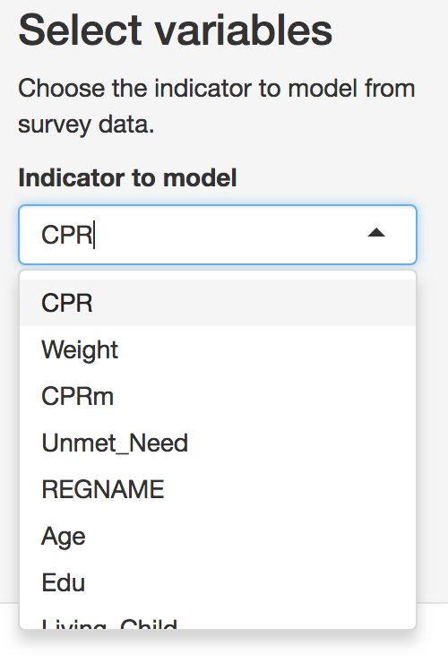{#id .class width=30% height=30%}
  
 
  
Note that only binary variables are currently supported.  Variables should be formatted as '0' or '1' only.  Users should then select which variable represents the region or strata names in the data, as these will be used both in mapping and in creation of fixed or random effects. These region names should also be present and identically named in the census data to ensure accurate matching between the datasets.  
  
   

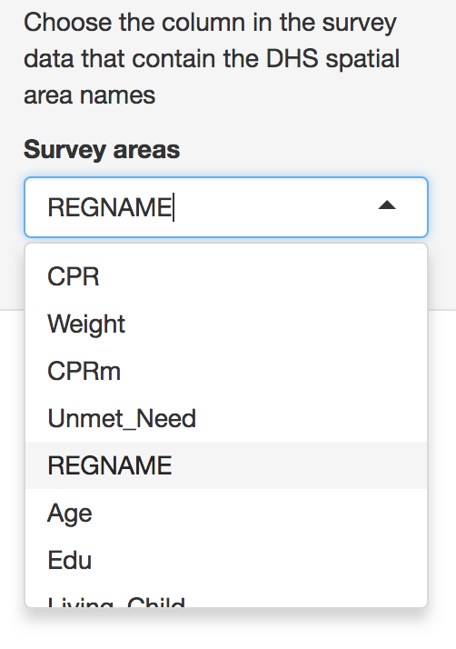{#id .class width=30% height=30%}
  
 
  
## Census
  
  
When selecting the census tab, default the map and table information will take some time to load as the datasets are larger.
 
  
{#id .class width=50% height=50%}
  
 
  
After the survey data are loaded, Census data should be loaded in a similar way. Note that the census data should include both the same survey stratum names as the survey data, as well as an additional spatial stratum representing the area at which predictions will be made.
  
  
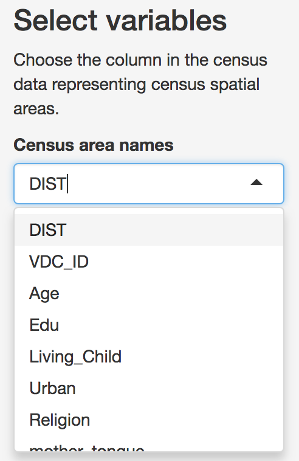{#id .class width=30% height=30%}
  
 
  
Users then can select the predictor variables that will be. Note that only predictors that appear in both survey and census data can be selected. To reduce confusion, it is best that the loaded data only include variables that will be relevant to the analysis. However, these variables can be removed later if they are not needed.
  
  
{#id .class width=30% height=30%}
  
***
  
  
# Compare Data 
Predictive modeling of small areas based on survey data relies on the assumption that the populations sampled in the survey are a random sample of the census. As such, the types of respondents in census and survey data should be present in similar ratios for each.  Therefore, before modeling the indicator of interest, it is important to compare the distribution in each.  
  
 
 
## Correlations
A simple way to check whether the two data types are related is to look at how closely they are correlated.  This can be difficult to do with binary data, so we aggregate these data at the level of survey regions and visualize as a scatterplot.  By default these correlations are only shown for variables checked in the 'Data Selection' tab.  

When opening the **Compare data** Tab, the first tab displays a scatterplot of the correlations between data variables. These plots are based on data aggregated at the survey region level. Variables that appear linearly correlated between survey and census shold be considered for inclusion in the model. Those that are not should be excluded, unless there is some reason to explicitly include them.
  
  
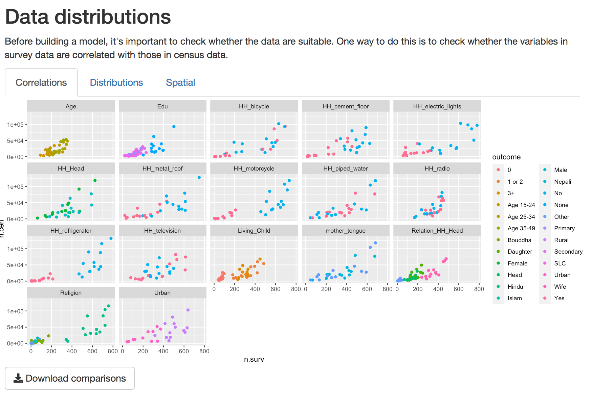{#id .class width=50% height=50%}
  
  
 
## Distributions.
For a closer look at individual predictors, in the distributions tab we look more closely at the distributions of individual variables to see how different levels of each variable correlate. Use the drop-down menu to select which variable to view. Here we can look more closely at the different levels of each variable. 
  
 

{#id .class width=50% height=50%}
  
  
 
## Spatial
Finally, it's important that the spatial distribution of effort is similar in survey and census data. The map in the spatial section shows the relative effort applied in each survey region. 
   

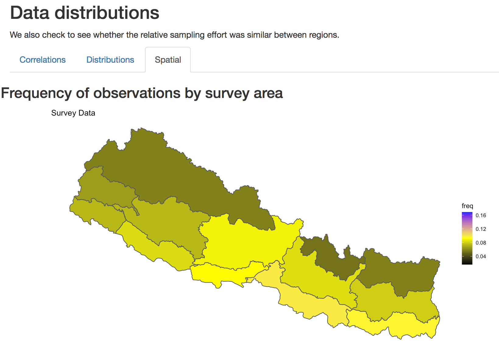{#id .class width=50% height=50%}

*** 
 

# Model Setup
The model setup tab provides tools to further check the suitability of variables for prediction before building the model. The model building component then allows you to see how inclusion of different parameters influences the model outcome.
   

{#id .class width=50% height=50%}

 
## Parameter Tests
The parameter tests component uses alias testing and variance inflation factors to look for variables that are highly correlated with one another.  The Alias test button looks for variables that are perfectly correlated, and must be run before the Collinearity or Variance Inflation Factors (VIF) test.  The VIF test checks each variable for variance inflation. Run the Alias test first, as the VIF test cannot run on variables that are nearly identical.  
 

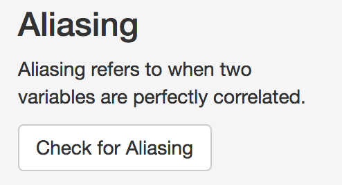{#id .class width=30% height=30%}

The results of the Alias test will indicate whether there are variables that need removing from the candidate variable set. 
 

{#id .class width=50% height=50%}
 

When variables are identified in the Alias test, you can remove them from the list of parameters
 

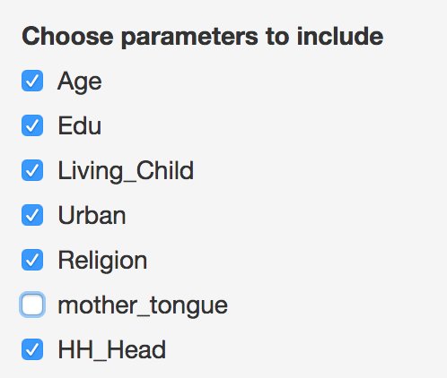{#id .class width=30% height=30%}

After removing the indicated variables from the list of predictors, you should re-run the alias test, then you can run the VIF test to test for collinearity. 
 

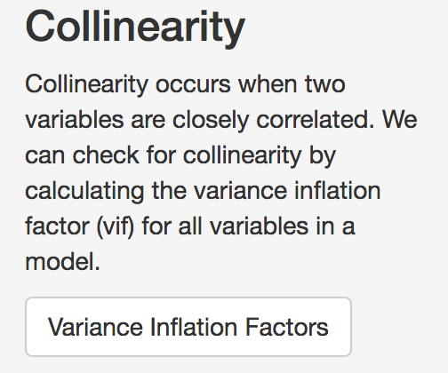{#id .class width=30% height=30%}

In the VIF test, results show a GVIF score and a degrees of freedom (DF). Variables that have a GVIF score of higher than 2 should be removed also, as including them may lead to unexpected predictions. 
 

{#id .class width=60% height=60%}
 

## Build the Model
Once the Variance inflation test has been done,  you can proceed to building the model by selecting the 'Build the Model'.  By default, the model consists of all variables that were not deselected in previous steps. As well, the spatial regions are by default included as a fixed effect.  
 

{#id .class width=60% height=60%}
 

The model  results are displayed as a summary table. In this summary, the estimates of the model coefficients are displayed on the logit scale, along with other statistics. Significance of each coefficient is indicated with stars, where * = significance at p=0.05, ** = significance at p=0.01, *** = significance at p=0.001. 

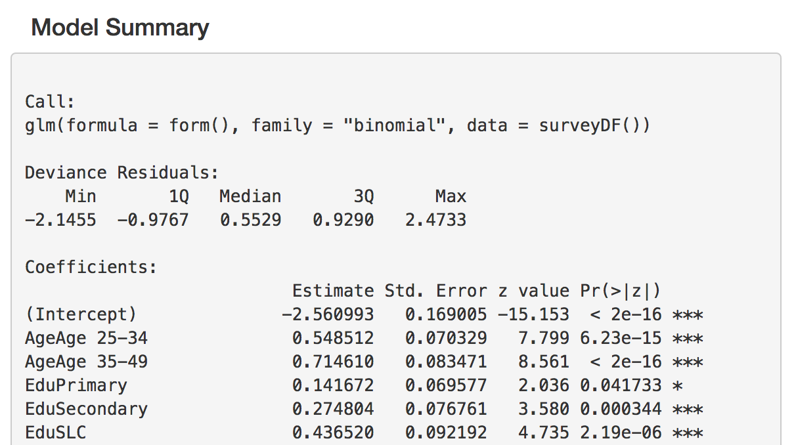{#id .class width=60% height=60%}
 

Every time a variable is added, the model is re-run, and a new summary table is built.  If you wish to save the results of a particular model, you can save them using the download button.  
 

### Stepwise Regression. 
While you may have predictors that you wish to include,  but it may be difficult to decide which combination of variables is best to use.  In this case, you may use the stepwise variable selection button to choose the most parsimonious set of variables.  The tool uses both forward and backwards stepwise selection, and retains the model with the lowest AIC score. The selected variables will remain checked in the list.  
 

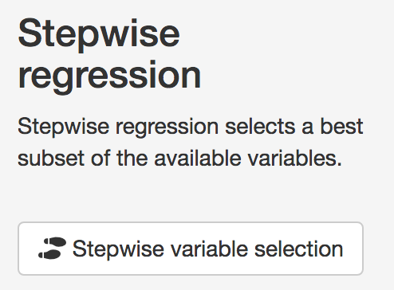{#id .class width=30% height=30%}

### Random effects
Because the sampling effort in each of the survey regions can often be different, treating thema s a fixed effect may not be the most reliable way to account for regional variations. Instead, it is possible to include spatial regions as a random effect. In this way, oversampling in some areas will not skew results, and the uncertainty in estimates will be properly accounted for. Checking the 'include random effects' box will change the fixed effects to random effects in the model.  
 

{#id .class width=30% height=30%}
 

Note that including random effects in the model will make it much slower to run.  It is best to first run the variable selection before including the random effect term.   
 

# Assessment of model fit
Following fitting of the model, it is important to check whether the model fit is suitable
 

## Assessment
The 'Assess' tab two a few ways to check the fit of the model.  The first is the residual plot, which shows each of the predicted response values used in the model against the difference between the observed and predicted values.  A model that has equal dispersion of points above and below the line indicates an unbiased fit. 
 

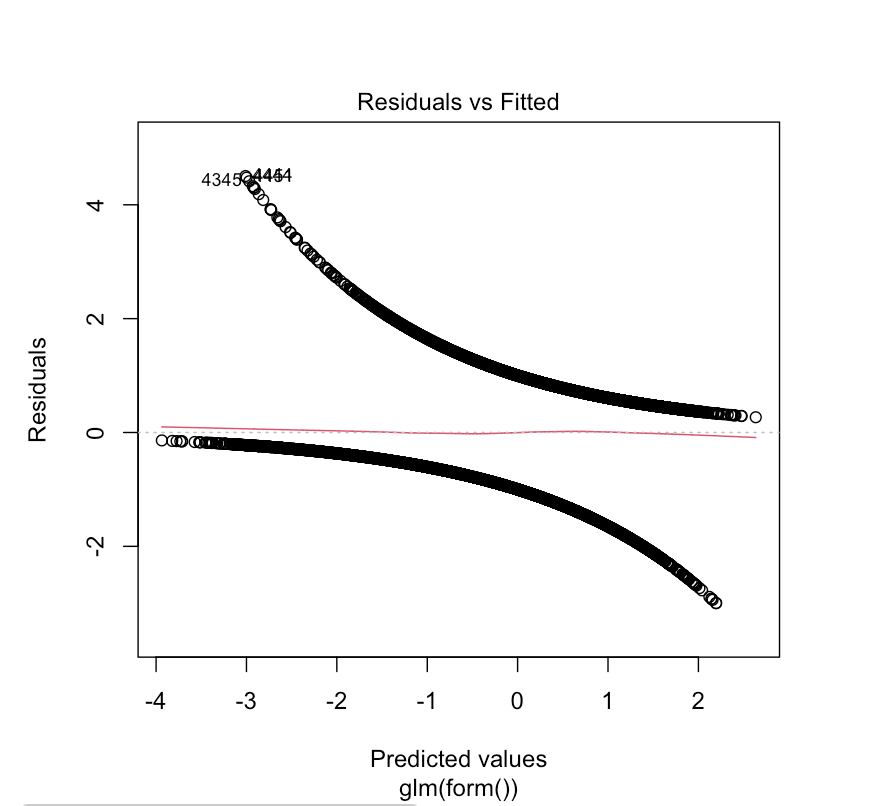{#id .class width=50% height=50%}
 

We can also look at howthe observed values compare to the fitted values.  With binary variables this can be challenging to intepret, se we can look at observed and predicted values aggregated in survey regions.  Note that because we have included survey regions as a fixed or random effect, we expect that the model will usually perform very well at this aggregated level. 
 

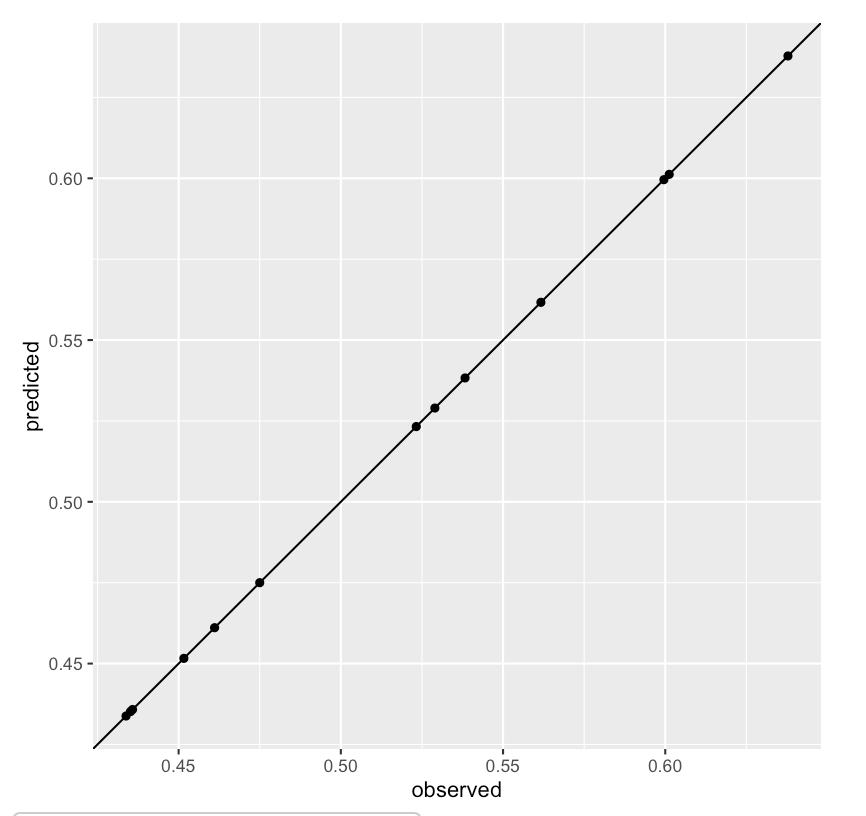{#id .class width=50% height=50%}

# Validation
Another way to evaluate  the predictive power for binomial random variables in a logistic model is to look at the percentage of times the model correctly classifies the response variable.  A Confusion matrix describes the percentage of time the model correctly predicts a true positive or true negative. A better-performing model should have higher true positive and negative rates than false rates. 
 

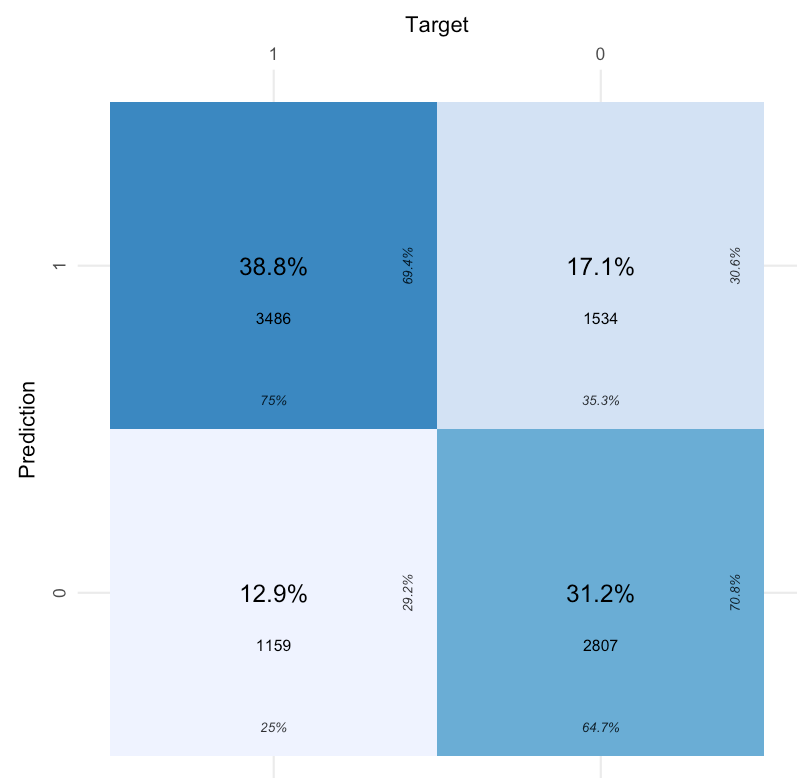{#id .class width=50% height=50%}
 

Another way to look at model performance is to examine the receiver-operator curve or ROC.  This curve plots 'Sensitivity' against 'Specificity', which can be described as the rate of false positives (y axis) at each level of true positivity (x axis). An ROC curve that is more convex (or farther from the diagonal) suggests better model performance.  The area under the ROC curve (or AUC) provides a measure of the model accuracy; an AUC of 0.5 means the model cannot predict with any accuracy, while an AUC means it is perfectly accurate.  Values of greater than 0.75 suggest relatively good model performance.    
 

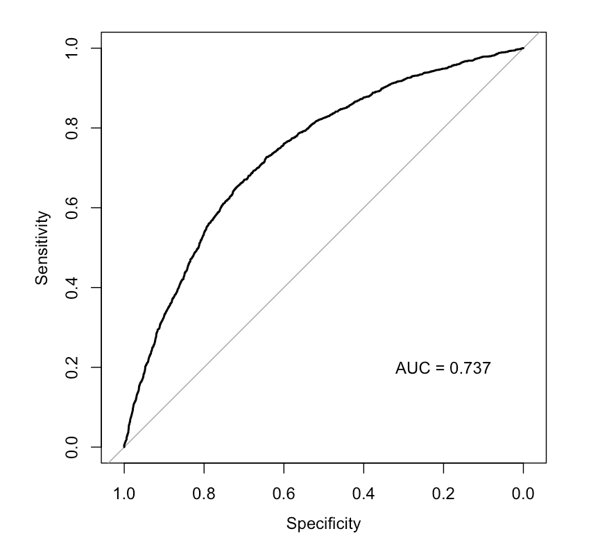{#id .class width=50% height=50%}
 

## Cross Validation
Finally, the goal of small area prediction is to predict data into areas that have not been sampled.  The most effective way to tell whether a model is reliable in this case is to perform croass-validation testing.  Here,  we randonly split the data into sections called 'Folds'.  In each iteration of the cross-validation, one of these folds is excluded from the main data (the testing data), then the remaining data are used to build the model (the training data).  The resulting model is then used to predict the indicator of interest in both sets of data with similar accuracy.  
 

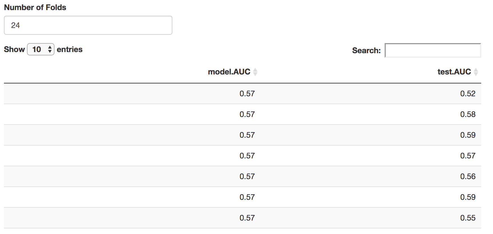{#id .class width=50% height=50%}
  
  
# Prediction
Now that we have assessed the model, we can use it to predict into the census data using the same predictor variables.  The predictions tab does this,  plotting the predictions at census scale, then survey region scale, then finally with direct estimates.  In the tabular data section,  the predictions are aggregated at both survey and census scales. A bootstrapped 95% confidence interval is also calculated for each region.
  

